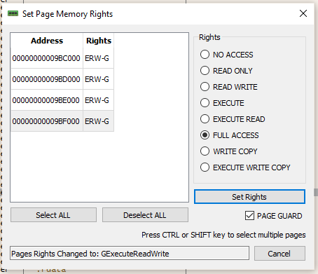
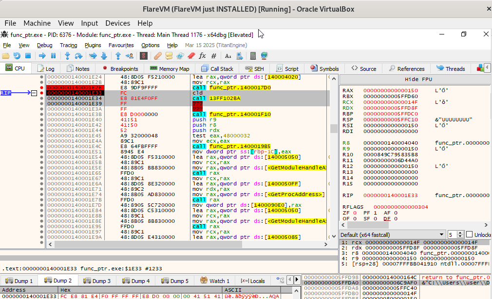
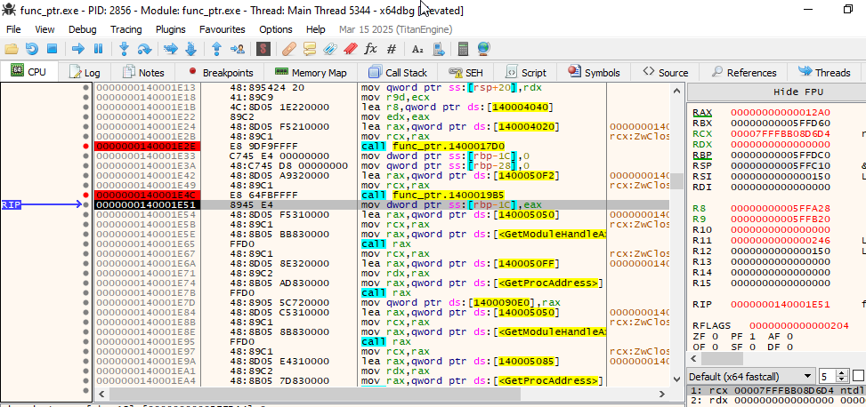
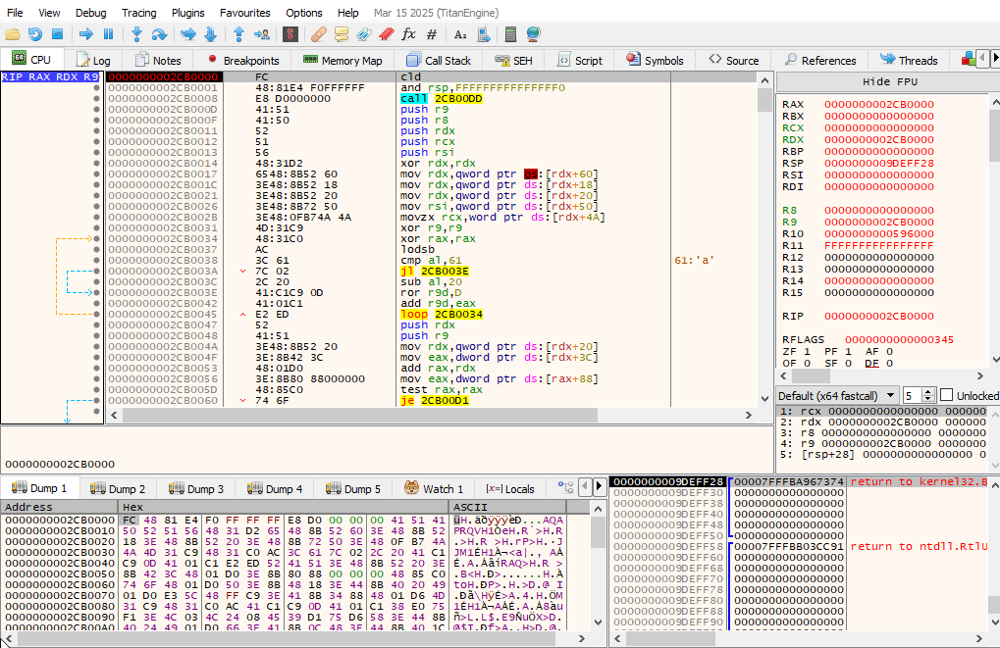

# Analysis of a shellcode

```
func_pointer.bin64: PE32+ executable (console) x86-64 (stripped to external PDB), for MS Windows, 11 sections
SHA256: edd41b4a819f917f81203424730aaf0c24cc95e40acfc0f1bd90b11dadf58015
```

## Basic static analysis

The sample is only 24 kB and targeting x64 Windows systems. It is probably not packed or heavily obfuscated, at least not in a way that significantly expands its file size. A small size often suggests either a very simple piece of malware, a loader/dropper that downloads a larger payload, or a highly optimized and potentially assembly-heavy piece of code. This small footprint also implies it might not contain a large amount of embedded resources or complex libraries. Therefore, we should be able to begin direct analysis of its code without extensive unpacking efforts.

Opening the file in Die [](assets/die_compiler.png), we see that the the program has been written in C/C++, using MinGW compiler. We can even retrieve the compilation timestamp (in pestudio or CFF Explorer): `2023-04-06 15:21:17`.

## Detailed static analysis

After a series of initialization (code automatically added by MinGW), an encrypted payload is decrypted. The algorithm used is a stream cipher, derivating 3 keys from an original one, and XORing the source with a calculus made from these 3 keys, `BYTE` by `BYTE`. The key used here is `"UUUUUUUU"`.

```c
__int64 __fastcall stream_cipher(char *key, int key_length, _BYTE *src, int src_length, _BYTE *dest)
{
  __int64 result; // rax
  int next_key; // [rsp+10h] [rbp-20h]
  int k; // [rsp+14h] [rbp-1Ch]
  char XOR_key; // [rsp+1Bh] [rbp-15h]
  int j; // [rsp+1Ch] [rbp-14h]
  int i; // [rsp+20h] [rbp-10h]
  unsigned int key3; // [rsp+24h] [rbp-Ch]
  unsigned int key1; // [rsp+28h] [rbp-8h]
  unsigned int key0; // [rsp+2Ch] [rbp-4h]

  key0 = 0;
  key1 = 0;
  key3 = 0;
  for ( i = 0; i <= 63; ++i )                   // iterates 64 times to generates 3 keys derivated from original one
  {
    key0 = (2 * key0) | ((unsigned __int8)((key1 >> 21) ^ (key0 >> 18) ^ ((int)(unsigned __int8)key[i % key_length] >> (i / 8))) ^ (unsigned __int8)(key3 >> 22)) & 1;
    key1 = (2 * key1) | (key0 >> 8) & 1;
    key3 = (2 * key3) | (key1 >> 10) & 1;
  }
  for ( j = 0; ; ++j )
  {
    result = (unsigned int)j;
    if ( j >= src_length )
      break;
    next_key = (((key1 >> 10) ^ (unsigned __int8)(key3 >> 10)) & BYTE1(key0) ^ (key1 >> 10) & (unsigned __int8)(key3 >> 10)) & 1;
    XOR_key = 0;
    for ( k = 0; k <= 7; ++k )
    {
      XOR_key |= ((((key1 >> 21) ^ (unsigned __int8)(key3 >> 22)) & (unsigned __int8)(key0 >> 18) ^ (key1 >> 21) & (unsigned __int8)(key3 >> 22)) & 1 ^ next_key) << k;
      key0 = (2 * key0) | (((key1 >> 21) ^ (unsigned __int8)(key3 >> 22)) & (unsigned __int8)(key0 >> 18) ^ (key1 >> 21) & (unsigned __int8)(key3 >> 22)) & 1 ^ next_key;
      key1 = (2 * key1) | (key0 >> 8) & 1;
      key3 = (2 * key3) | (key1 >> 10) & 1;
    }
    dest[j] = XOR_key ^ src[j];
  }
  return result;
}
```

The encrypted data is as follows:

```
encrypted_payload db  8Dh,   9, 8Dh, 59h,0A0h, 1Fh, 83h, 0Ah, 9Eh, 86h, 28h,0B9h,0CAh, 73h,0E2h,0D7h, 1Dh
                                        ; DATA XREF: main+84↑o
                db  38h, 3Dh, 30h, 94h,0D5h,0FEh, 7Dh,0D0h, 32h, 64h,0D3h,0F5h, 0Fh, 29h, 3Eh, 95h,0ABh
                db  9Ch, 38h, 4Ch, 3Eh,0CBh,0E0h,0D3h,0CAh, 6Dh, 2Bh,0E2h, 59h, 18h,0FFh, 9Fh, 67h, 63h
                db  97h,0F9h, 9Bh, 54h,   6, 6Fh,0FCh,0E9h, 17h, 78h, 87h, 61h,0EAh,0CCh, 24h,   9, 49h
                db  80h,0E8h,0FFh,   0,0D1h,0D3h,0BAh, 5Ch, 2Fh, 72h,   1, 3Bh,0A2h, 0Ah, 74h,   9, 0Bh
                db 0C2h, 6Ch, 1Bh,   2, 0Ch, 14h,0A4h, 20h, 69h, 80h,0E9h, 3Ch, 27h,   9, 0Bh,0C2h,   2
                db 0AEh,   9,0CCh, 0Ch, 9Ah, 64h,0AAh, 45h,   9,   1, 49h, 91h,0E9h, 4Eh, 1Ah, 6Fh, 4Bh
                db 0BAh, 55h, 2Fh, 14h,0A9h, 4Dh, 28h, 9Eh,   5, 70h,0C3h, 5Ah, 63h, 50h, 2Eh,0C5h,0D5h
                db  6Dh, 2Dh, 60h,   4,0E8h, 70h,0A8h, 34h,0FBh, 2Ch, 1Eh, 93h,0CEh,0A0h, 1Ch,0E1h, 19h
                db 0F0h, 70h,0FFh, 10h, 76h,   5, 81h, 52h, 76h,0D9h, 83h, 54h, 72h, 9Ah, 61h,0AAh,   9
                db  61h, 76h, 0Ch,0CAh, 4Ah, 0Eh, 1Bh, 91h, 52h,0BAh, 55h, 2Fh, 24h,0A9h, 4Dh, 28h, 98h
                db    9, 19h, 4Bh, 4Ah, 0Ch,0C9h,0D8h,0C5h, 4Ch,0E5h, 79h, 60h, 5Fh, 61h,0CBh,0A4h, 61h
                db  4Bh, 40h,0ADh, 70h,0DAh,0C5h, 4Dh,0FEh, 1Eh, 69h, 8Eh, 3Bh,0A1h,   1,0BEh,0F5h,0EDh
                db  0Fh,0D9h, 45h, 45h, 14h,0A4h, 20h, 21h, 3Bh, 61h,0C5h,0DDh, 5Bh, 0Bh, 12h, 52h,0AEh
                db 0CEh,   9, 91h, 91h, 21h, 21h,   5, 61h, 79h, 81h,   0,0B0h, 57h,0D1h,0C6h, 85h, 7Bh
                db 0C1h, 1Fh,0C0h, 3Ch, 2Fh, 23h,   9,0F2h,0E7h, 9Fh,0AFh,0CFh, 6Fh, 57h,0CCh, 97h, 60h
                db    8, 1Dh,   3, 55h, 42h,0C8h,0BAh,0EAh, 67h, 57h, 2Bh,0C5h, 97h, 66h,0CBh, 4Ah, 21h
                db  5Ch, 68h,0C1h, 92h,0BEh,0DFh, 5Ah,   6,0D2h,0A2h,0D4h, 43h,0EAh,   0, 74h, 25h, 6Bh
                db  2Dh, 68h,   9, 6Bh, 62h, 22h,0E9h,0A2h, 84h, 14h,0A4h, 20h, 21h,   5, 29h, 48h,   0
                db  15h, 48h, 28h, 72h,0DDh,0E3h,0E8h, 46h,0C1h, 56h, 21h, 95h,0B9h
```

All sensitive function are loaded at runtime to avoid being detected in the imports. The PID of the running process launched by `explorer.exe` is retrieved, to then allocate memory remotely (`VirtualAllocEx`), write the decoded payload (`WriteProcessMemory`) and execute the code as a remote thread (`CreateRemoteThread`). 


## YARA

The following YARA rules helps identifying this malware, which decrypts a payload using a specific key, and injects itself into `explorer.exe` process.

```php
rule injector {
	meta:
		description = "Generic shellcode injecting payload to explorer.exe"

	strings:
		$explorer = "explorer.exe"

		$func1 = "VirtualAllocEx"
		$func2 = "WriteProcessMemory"
		$func3 = "CreateRemoteThread"

		$key = "UUUUUUUU"

	condition:
		is_pe and
		$explorer and
		all of ($func*) and
		$key
}
```


# Analysis of the payload

Once decrypted and dumped, here's the raw shellcode's content:

```
┌────────┬─────────────────────────┬─────────────────────────┬────────┬────────┐
│00000000│ fc 48 81 e4 f0 ff ff ff ┊ e8 d0 00 00 00 41 51 41 │×H××××××┊××000AQA│
│00000010│ 50 52 51 56 48 31 d2 65 ┊ 48 8b 52 60 3e 48 8b 52 │PRQVH1×e┊H×R`>H×R│
│00000020│ 18 3e 48 8b 52 20 3e 48 ┊ 8b 72 50 3e 48 0f b7 4a │•>H×R >H┊×rP>H•×J│
│00000030│ 4a 4d 31 c9 48 31 c0 ac ┊ 3c 61 7c 02 2c 20 41 c1 │JM1×H1××┊<a|•, A×│
│00000040│ c9 0d 41 01 c1 e2 ed 52 ┊ 41 51 3e 48 8b 52 20 3e │×_A•×××R┊AQ>H×R >│
│00000050│ 8b 42 3c 48 01 d0 3e 8b ┊ 80 88 00 00 00 48 85 c0 │×B<H•×>×┊××000H××│
│00000060│ 74 6f 48 01 d0 50 3e 8b ┊ 48 18 3e 44 8b 40 20 49 │toH•×P>×┊H•>D×@ I│
│00000070│ 01 d0 e3 5c 48 ff c9 3e ┊ 41 8b 34 88 48 01 d6 4d │•××\H××>┊A×4×H•×M│
│00000080│ 31 c9 48 31 c0 ac 41 c1 ┊ c9 0d 41 01 c1 38 e0 75 │1×H1××A×┊×_A•×8×u│
│00000090│ f1 3e 4c 03 4c 24 08 45 ┊ 39 d1 75 d6 58 3e 44 8b │×>L•L$•E┊9×u×X>D×│
│000000a0│ 40 24 49 01 d0 66 3e 41 ┊ 8b 0c 48 3e 44 8b 40 1c │@$I•×f>A┊×_H>D×@•│
│000000b0│ 49 01 d0 3e 41 8b 04 88 ┊ 48 01 d0 41 58 41 58 5e │I•×>Aו×┊H•×AXAX^│
│000000c0│ 59 5a 41 58 41 59 41 5a ┊ 48 83 ec 20 41 52 ff e0 │YZAXAYAZ┊H×× AR××│
│000000d0│ 58 41 59 5a 3e 48 8b 12 ┊ e9 49 ff ff ff 5d 49 c7 │XAYZ>Hו┊×I×××]I×│
│000000e0│ c1 00 00 00 00 3e 48 8d ┊ 95 1a 01 00 00 3e 4c 8d │×0000>H×┊ו•00>L×│
│000000f0│ 85 35 01 00 00 48 31 c9 ┊ 41 ba 45 83 56 07 ff d5 │×5•00H1×┊A×E×V•××│
│00000100│ bb e0 1d 2a 0a 41 ba a6 ┊ 95 bd 9d ff d5 48 83 c4 │×ו*_A××┊×××××H××│
│00000110│ 28 3c 06 7c 0a 80 fb e0 ┊ 75 05 bb 47 13 72 6f 6a │(<•|_×××┊u•×G•roj│
│00000120│ 00 59 41 89 da ff d5 48 ┊ 54 42 20 50 57 4e 20 55 │0YA××××H┊TB PWN U│
│00000130│ 20 42 65 20 48 61 70 70 ┊ 79 20 00 00 00 00 00 00 │ Be Happ┊y 000000│
│00000140│ 00 00 48 54 42 3a 20 4d ┊ 61 6c 52 65 76 00 90 90 │00HTB: M┊alRev0××│
└────────┴─────────────────────────┴─────────────────────────┴────────┴────────┘
```


When opening the payload in IDA as x64 code, the listing view is weird, as it seems to be a mixture of instructions and raw data. Let's try to execute the payload in the debugger. There is two different ways of doing it:
1. We can jump on the decoded payload from the malware process. One thing is that the payload is decrypted on the stack, which is non executable by default. We can either:
  a. Change the permissions of the stack pages to make it executable

  

  b. Copy the content of the payload to .text section.

  

2. Attach our debugger to the injected process (`explorer.exe`) and set a breakpoint on the injected payload there. For this, we need to:
  a. Set a breakpoint on the original malware to get the correct PID of the injected process.

  
  
  

For practicing, we'll use the more complex option, 2. The first issue we got is that `explorer.exe` not only manages `File Explorer`, but among many, user interface interaction. Attaching our debugger to `explorer.exe` process will freeze the VM. Then a trick would be to attach to another non critical process, and modify the value of the PID used for the injection in the malware process. We can get the start address of the page allocated by checking the return address of the call to `VirtualAllocEx()` and see that the payload is correctly written at that address in the injected process after the call to `WriteProcessMemory()`. We set a breakpoint in the injected process at this address, which will be hit when the malware runs it (`CreateRemoteThread`).

Doing this dynamic analysis guides us understanding the code, and finally working correctly on our IDB. On trick is used to get real address (adjusted depending on where the memory was allocated), with the following sequence:

```as
  call    loc_DD

loc_DD:
  pop     rbp
```

`rbp` is the correct address of the return address (the one just after the `call loc_DD`). The value of `rbp` can then be used to search for data (strings in our case) that are located at a certain offset in the payload. This trick is used to get the address of 2 strings, "HTB PAWN U Be Happy" (in `rdx`) and "HTB Malrev" (in `r8`).

Eventually, the payload uses some other tricks to retrieve the address of correct libraries and functions in order to display a message box, with the title "HTB: MalRev" and content "HTB PWN U Be Happy".
